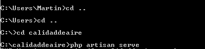

## SISTEMA PARA CALIDAD DE AIRE

## Pasos para instalar

- Descargar el proyecto y descomprimir en un directorio C:\calidad de aire (puede ser cualquier ruta)
- Restaurar la base de datos (carpeta sql) y configurarla en el archivo .env
- Ingresar al directorio anterior y levantar el servidor web
  C:\calidaddeaire>php artisan serve
  
- Pegar en el navegador la siguiente url
  http://localhost:8000/inicio

## Pasos para clonar un repositorio

- Configuramos git en el local
  git config --global user.name "nombre"
  git config --global user.email micorreo@gmail.com
  git config --global color.ui true
- Inicializamos git
  git init
- Clonamos el repositorio
  git clone <URL>
- Agregamos los archivos que se van a subir
  git add .
- Creamos commit
  git commit -m "First commit"
- Subir los cambios al servidor
  git push origin master

## Para un repositorio clonado

- Actualizamos los archivos desde el servidor
  git pull
- Unimos si existen conflictos
  git merge <branch>

